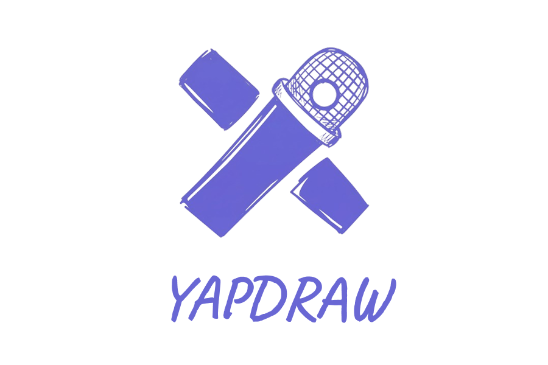

<div align="center">



_Why draw it with your mouse when you can just yap it out?_

</div>

---

## Overview

YapDraw is Wispr Flow for Excalidraw. Describe anything out loud — a system architecture, a business process, a research workflow, a project plan — and it draws it as a clean, editable Excalidraw diagram. No code, no syntax, no drag-and-drop.

For engineers, students, educators, researchers, business analysts, or anyone who has ever stared at a blank whiteboard.

---

## Features

- **Just talk** — no special syntax, no templates. Describe it the way you'd explain it to a colleague and it figures out the rest
- **Handles how people actually speak** — mid-sentence corrections, filler words, backtracking — the final diagram reflects your intent, not your exact words
- **Truly incremental** — say "add X" or "remove Y" and only that changes. The rest of your diagram stays exactly where it is
- **Fully editable output** — every diagram lands on an Excalidraw canvas. Drag nodes, adjust layout, add annotations — it's yours to edit
- **Undo AI changes** — every generation is snapshotted. Cmd+Z reverts the last AI change without touching anything you edited manually
- **Three modes** — Freeform (anything), System Architecture (layered service graphs), Process Flowchart (decision trees, approval flows, research pipelines)
- **Local-first** — auto-saves to your browser, no account needed

---

## How to Use

1. Open the library and create a new diagram
2. Pick a mode — when in doubt, use Freeform
3. Hit the mic and describe what you want
4. Keep talking to refine — add, remove, or change anything
5. Drag nodes around or hit Cmd+Z to undo the last AI change

**Tips:**

- Talk like you're explaining it to someone, not writing a spec. "So we have a React frontend, it calls our Node API, which reads from Postgres — oh and Redis for session caching" works perfectly.
- Corrections are handled automatically: "it connects to S3 — actually we use GCS" will use GCS.
- For updates, just say what changed: "remove the message queue" or "add an analytics service between the API and the database."

---

## Tech Stack

| Layer               | Tech       |
| ------------------- | ---------- |
| Framework           | Next.js    |
| Canvas              | Excalidraw |
| Layout engine       | Dagre      |
| Voice transcription | Deepgram   |
| Storage             | Supabase   |

---

## Setup

```bash
cd yapdraw
npm install
cp .env.example .env
npm run dev
```

Required env vars:

```
DEEPGRAM_API_KEY=...
LLM_BASE_URL=...
LLM_MODEL=your_model_name
LLM_API_KEY=...
```
