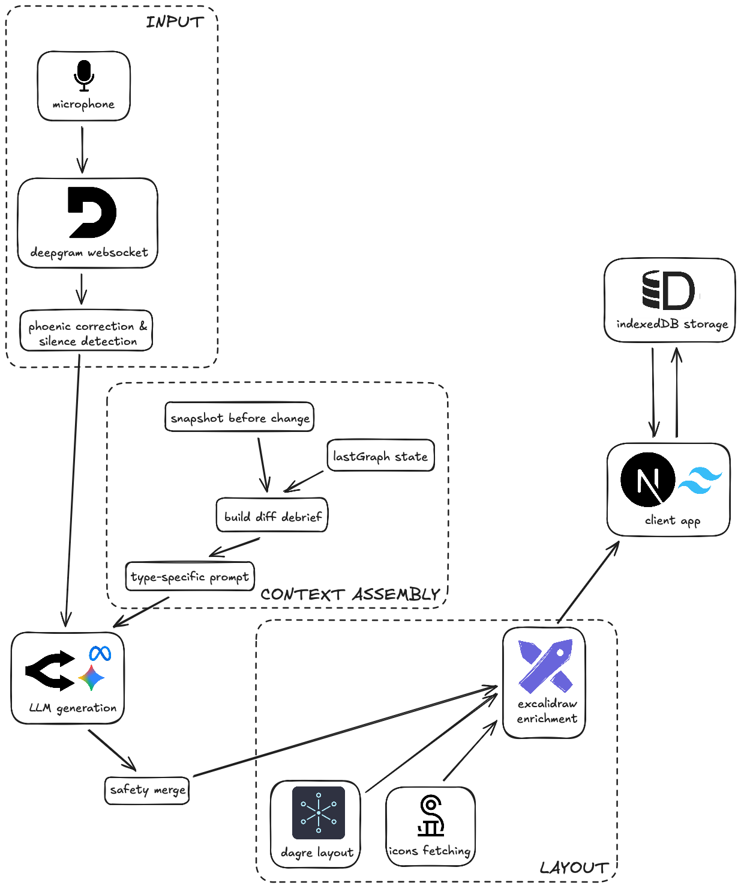

<div align="center">

<a href="https://yapdraw.vercel.app">

</a>

# YapDraw

_Build diagrams at the speed of speech._

</div>

---

## Overview

YapDraw is [Wispr Flow](https://wisprflow.ai) for [Excalidraw](https://excalidraw.com).

Describe anything out loud — a system architecture, a business process, a research workflow, a project plan — and it draws it as a clean, editable Excalidraw diagram. No code, no syntax, no drag-and-drop. For anyone who has ever stared at a blank whiteboard.

## Demo

https://github.com/user-attachments/assets/a8a7e6f6-1319-453d-9f0d-508b923a1427

Watch it on [YouTube](https://youtu.be/gSKKap_LVrg).

## Features

- **Just talk** — mid-sentence corrections, filler words, backtracking — it reflects your intent, not your exact words. No syntax, no templates.
- **Incremental updates** — the current diagram and your manual edits are always passed as context. Say "add X" and only X changes — unlike one-shot generators that rebuild from scratch.
- **Local-first** — auto-saves to your browser. No account, no data leaving your machine.
- **Undo AI changes** — every generation is snapshotted. Use `[` / `]` to step through AI change history without touching anything you edited manually.
- **Three modes** — Freeform (anything), System Architecture (layered service graphs), Process Flowchart (decision trees, approval flows, research plans).

## How to Use

1. Open the library and create a new diagram
2. Pick a mode — when in doubt, use Freeform
3. Hit the mic and describe what you want
4. Keep talking to refine — add, remove, or change anything
5. Drag nodes around, or use `[` / `]` to step through AI change history

Works out of the box on the free tier. For higher limits, add your own OpenRouter or Gemini key in the settings panel (⚙️ top right).

**Tips:**

- Talk like you're explaining it to someone, not writing a spec. "So we have a React frontend, it calls our Node API, which reads from Postgres — oh and Redis for session caching" works perfectly.
- Corrections are handled automatically: "it connects to S3 — actually we use GCS" will use GCS.
- For updates, just say what changed: "remove the message queue" or "add an analytics service between the API and the database."

## Tech Stack

- Framework: Next.js
- Canvas: Excalidraw
- Layout engine: Dagre
- Speech-to-text: Deepgram
- Storage: Dexie (IndexedDB, local-first)

## How it works



## Local Development

```bash
npm install
cp .env.example .env
npm run dev
```

Required env vars:

```bash
DEEPGRAM_API_KEY=...      # console.deepgram.com — create with Admin role (not default Member)
DEEPGRAM_PROJECT_ID=...   # console.deepgram.com → your project settings
GROQ_API_KEY=...          # console.groq.com — free tier available
```

You can also bring your own OpenRouter or Gemini key via the in-app settings — no env var needed for that.

## Self-Hosting

Deploy your own instance in a few steps:

1. Fork this repo
2. Create a [Vercel](https://vercel.com) project and import the fork
3. Add the required environment variables in Vercel's project settings:
   ```bash
   DEEPGRAM_API_KEY=...
   DEEPGRAM_PROJECT_ID=...
   GROQ_API_KEY=...
   ```
4. Deploy — Vercel will build and serve the app automatically

No database setup needed. All diagram data is stored locally in the user's browser.

## Contributing

PRs are welcome. For anything beyond small fixes, open an issue first so we can align on the approach.

## Acknowledgements

Built on top of [Excalidraw](https://github.com/excalidraw/excalidraw) — the open-source canvas that makes the drawing side possible.

## License

[MIT](LICENSE).

---


